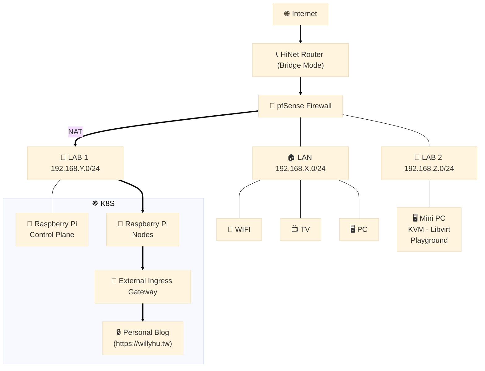
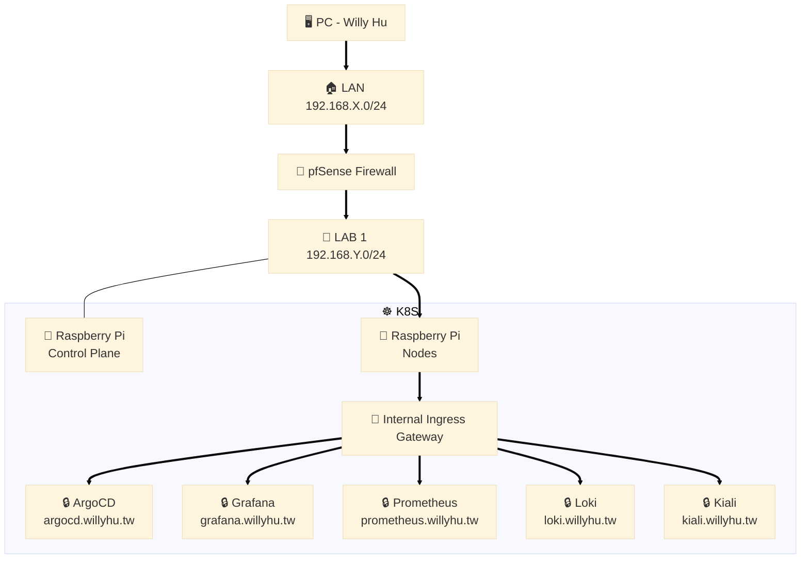
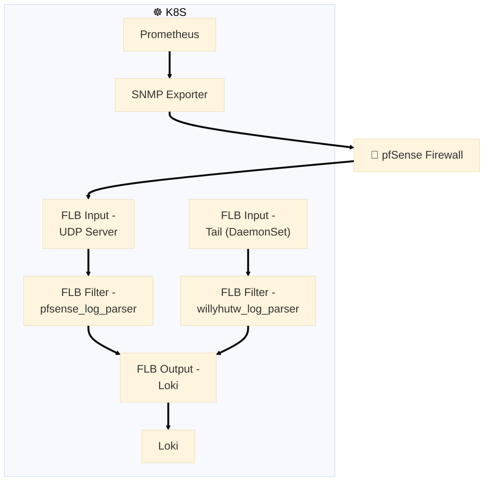

**Project Link**:
- [https://github.com/willyhutw/microlab-bootstrap](https://github.com/willyhutw/microlab-bootstrap)
- [https://github.com/willyhutw/microlab](https://github.com/willyhutw/microlab)

### 起源

2023年因緣際會，時常跟一位我很尊敬的前輩混在一起 :P 那時候三不五時就會聽他提到**pfSense**這套軟體防火牆和他家「**機房**」的各種大小事，非常酷！我也想玩玩看！其實我一直以來都很想要有個Lab，可長期用來測試或跑些有的沒的，雖然透過IaC再加上一系列的自動化也能輕鬆一鍵在雲端佈署想要的實驗環境，但我就是很怕會忘了刪掉。 

一開始想省錢，只靠一台小PC插滿USB網卡跑VM，其實這樣窮酸的作法絕對可行，前提是那台機器要夠穩。有段時間我每隔一到兩天就會遇到kernel噴網卡相關的錯誤，然後就是全家沒網路可用、電視不能看、掃地機器人叫不動，幾次下來我真的不敢了… 

後來我把pfSense安裝在專門用來當作路由器的特製小PC([Protectli Vault FW4B](https://www.amazon.com/dp/B07G9NHRGQ))，到目前為止跑了兩年多，pfSense也升了好幾個版本，完全沒出過事。原本的小PC(Intel NUC)變成主要Lab繼續用KVM Libvirt跑K8S。 

人沒事就是會找事做。不曉得為什麼，有段時間我就很想把樹莓派疊在一起跑K8S。然後就買了一台樹莓派5(8G)，有了一台覺得該買第二台，有了兩台又覺得至少要四台，有了四台又覺得其實六台才是最完美的…最後理智勝出，我只有四台。再來就是規劃新的Lab，也需要把原本跑在amd64架構上的容器遷移到arm64架構，聽起來感覺沒什麼，但其實過程中遇到不少坑，之後看有沒有機會再聊這部份！ 

我知道目前Lab還有很多地方可以再調整到更好，但我現在真的只有在閒暇之餘或心血來潮時才有動力…偶爾也會有念頭想把它們通通都關掉，覺得好像沒什麼價值多浪費電而已(每月20~25kWh)。那我就趁還沒關掉前分享一下目前Lab的架構，也算是替自己紀錄，希望未來能有動力分享更多。

### 對外服務

**Hightlights**:
- 防火牆對外只開 TCP: 80, 443.
- 防火牆 (Public IP) 與 exteral-ingress-gateway (Private IP) NAT.
- PersonalBlog's Gateway 指向(label selector) exteral-ingress-gateway.
- Cert-manager + Let's encrypt certificate + https redirect to PersonalBlog's Gateway.
- Cloudflare DNS託管 + CDN, 避免對外IP暴露.

---

### 內部服務

**Hightlights**:
- 防火牆規則:
  - LAN與所有LABs皆隔離不能互相訪問.
  - 除了我之外 (DHCP Static Mappings).
- InternalServices Gateway 指向(label selector) internal-ingress-gateway.
- Cert-manager + Let's encrypt certificate + https redirect to InternalServices Gateway.
- Proper Gateway/VirtualService allowing host for InternalServices.
- 防火牆內部DNS(resolver) host override.
  - argocd.willyhu.tw => internal-ingress-gateway's privete ip (192.168.12.X)
  - grafana.willyhu.tw => internal-ingress-gateway's privete ip (192.168.12.X)
  - ...

---

### Data ETL Pipeline

**Hightlights**:
  - 防火牆Metric:
    - 開啟SNMP服務並且只允許LAB network存取.
    - SNMP Exporter fetch metrics from firewall.
    - Prometheus scrape from SNMP Exporter.
    - 參考: https://www.willyhu.tw/posts/snmp-exporter-for-pfsense/
  - 防火牆Log: FluentBit
    - 參考: https://www.willyhu.tw/posts/pfsense-filterlog-collection/
  - PersonalBlog's Log: FluentBit
  
